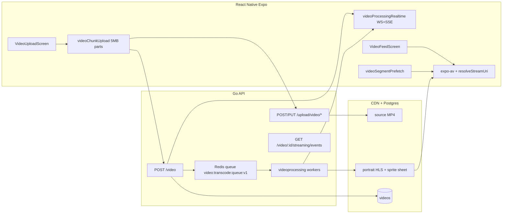

# Short-Video Streaming Architecture (Expo + Go)

End-to-end design for TikTok-class perceived performance: upload → transcode → CDN → adaptive playback in `VideoFeedScreen`.

**French executive summary:** [VIDEO_STREAMING_SHORT_FORM.fr.md](./VIDEO_STREAMING_SHORT_FORM.fr.md)

## System overview

## Upload path

| Step | Component | Notes |
|------|-----------|--------|
| 1 | `VideoUploadScreen` | Pick video, validate duration |
| 2 | `uploadVideoChunked` | 5MB parts → `POST /upload/video/init`, `PUT …/chunk`, `POST …/complete` |
| 3 | `uploadRentVideoPipeline` | `POST /video` then **WebSocket** `video:processing` (+ SSE fallback, rare poll) |
| 4 | `CreateVideo` | `processing_status=pending`, `Enqueue(db, id, userID)` |
| 5 | Redis workers | FFmpeg portrait ladder → CDN |

**Phase 2:** presigned direct-to-CDN chunk PUT (API only coordinates manifest).

## Realtime processing status

| Channel | Endpoint / event | Use |
|---------|------------------|-----|
| WebSocket | `video:processing` via `messagingWs` | Primary after upload |
| SSE | `GET /api/video/:id/streaming/events` | Fallback when WS unavailable |
| REST | `GET /api/video/:id/streaming` | Slow poll every 8s as last resort |

## Transcoding pipeline (Go)

**Package:** `services/videoprocessing`

- **Portrait ladder:** 360×640, 540×960, 720×1280, 1080×1920
- **Segments:** `-hls_init_time 2` (first ~2s), `-hls_time 4` thereafter
- **Codecs:** H.264 `-preset veryfast -profile:v high` + AAC
- **Sprite sheet:** 5×5 tile, 1 frame / 2s (`sprite_sheet_url`)
- **Blur placeholder:** `preview_blur_url` — JPEG 320px + `boxblur` (feed placeholder)
- **CDN cache:** `storage/media_cache.go` — `.m3u8` TTL 5s, segments `immutable` 1y
- **Queue:** Redis list `video:transcode:queue:v1` + `VIDEO_WORKER_COUNT` workers (goroutine fallback if Redis down)
- **Env:** `FFMPEG_PATH`, `VIDEO_PROCESSING_ENABLED=false` for MP4-only

## Playback (mobile)

| Layer | File | Role |
|-------|------|------|
| Device tier | `utils/deviceStreamingProfile.ts` | low/mid/high → max height, prefetch window |
| URL pick | `config/videoPlayback.ts` | Device profile + HLS > mobile MP4 > source |
| Segment warm | `services/videoSegmentPrefetch.ts` | Master→variant; seg 1 (+2 on Wi‑Fi); abort on fast scroll |
| QoE (dev) | `services/videoPlaybackMetrics.ts` | TTFF, rebuffer hooks |
| Buffer | `services/videoPreloadService.ts` | Metadata window |
| Mount | `hooks/Videopreloadmanager.ts` | ±N decoders, release off-window |
| List | `VideoFeedScreen` | Viewability + segment prefetch effect |
| Player | `expo-av` | AVPlayer / ExoPlayer HLS |

### Prefetch policy (Instagram/TikTok-style)

- **Current** + next **2** + previous **1** (high tier; reduced on poor network)
- **Only first HLS segment** for off-screen items
- **Cancel** in-flight segment fetches when index jumps >1 within 400ms

## Database

Migration `018_video_processing_v2.sql`: `processing_progress`, `sprite_sheet_url`, `sprite_vtt_url`.

## Property sale videos

Sale listings still upload MP4 in listing JSON. Reuse `videoprocessing.Enqueue` with a sale entity type when ready.

## Media size optimization

Uploads are normalized with CRF/WebP before CDN — see [MEDIA_OPTIMIZATION.md](./MEDIA_OPTIMIZATION.md).

## Ops checklist

1. FFmpeg on worker hosts (`libx264`, `libwebp`)
2. Redis for transcode queue
3. Run migrations 017 + 018
4. CDN CORS for `.m3u8` / `.ts`
5. Upload test video → confirm WS/SSE progress → `hlsURL` in feed
6. Scroll feed — verify first-segment prefetch in network panel
